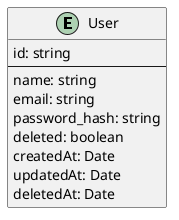

# ER 図 - Trello Clone

```puml
@startuml

entity User {
  id: string
  --
  name: string
  email: string
  password_hash: string
  deleted: boolean
  createdAt: Date
  updatedAt: Date
  deletedAt: Date
}


@enduml
```
